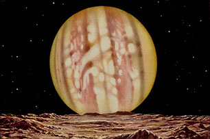

# Rudaux

Rudaux is a course management module to interface the Canvas Learning Management System (LMS) with JupyterHub. Rudaux helps you programmatially administer a course being taught in JupyterHub

Rudaux assists in:

- true autograding - scheduling `cron` events to kick off [`nbgrader`](https://github.com/jupyter/nbgrader) autograding
- creating assignments in Canvas with links to your JupyterHub notebooks using [`nbgitpuller`](https://github.com/data-8/nbgitpuller)

[Rudaux Documentation](https://samhinshaw.github.io/rudaux-docs)

Rudaux is named after the French artist and astronomer Lucien Rudaux who was a pioneer in space artistry and one of the first artists to paint Jupiter.

